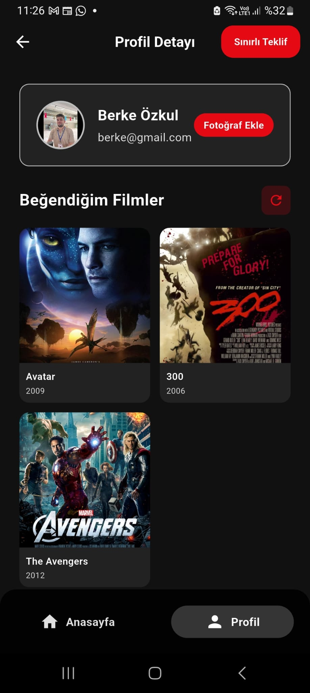

# SinFlix - Flutter Movie Application

## 📱 Proje Genel Bakış

SinFlix, modern Flutter teknolojileri kullanılarak geliştirilmiş, kullanıcı dostu bir film uygulamasıdır. Uygulama, MVVM (Model-View-ViewModel) mimarisi ve BLoC (Business Logic Component) state management pattern'i kullanılarak tasarlanmıştır.

## 🏗️ Mimari Yapı

### MVVM (Model-View-ViewModel) Mimarisi

Uygulama, MVVM mimarisine uygun olarak organize edilmiştir:

```
lib/
├── models/          # Model Layer (Data Models)
├── views/           # View Layer (UI Components)
├── blocs/           # ViewModel Layer (Business Logic)
├── repositories/    # Data Access Layer
├── services/        # External Services
├── utils/           # Utilities & Helpers
└── l10n/            # Localization
```

### BLoC State Management

Uygulama, Flutter BLoC pattern'ini kullanarak state management sağlar:

- **Event**: Kullanıcı etkileşimleri ve sistem olayları
- **State**: UI'ın gösterileceği durumlar
- **Bloc**: Event'leri State'lere dönüştüren business logic

## 📦 Kullanılan Paketler

### Core Dependencies

```yaml
dependencies:
  flutter:
    sdk: flutter
  
  # State Management
  flutter_bloc: ^8.1.4
  equatable: ^2.0.5
  
  # Network & API
  http: ^1.1.0
  
  # Storage & Security
  flutter_secure_storage: ^9.0.0
  
  # Image Handling
  image_picker: ^1.1.2
  image: ^4.1.7
  
  # Firebase Services
  firebase_core: ^2.24.2
  firebase_storage: ^11.6.6
  firebase_crashlytics: ^3.4.16
  firebase_analytics: ^10.8.7
  
  # UI & Animations
  lottie: ^2.7.0
  
  # Localization
  flutter_localizations:
    sdk: flutter
  intl: ^0.18.1
  
  # Utilities
  path_provider: ^2.1.2
  shared_preferences: ^2.5.3
```

### Development Dependencies

```yaml
dev_dependencies:
  flutter_test:
    sdk: flutter
  flutter_lints: ^3.0.0
  
  # Code Generation
  flutter_gen_runner: ^5.4.0
  
  # Icons & Splash
  flutter_launcher_icons: ^0.13.1
```

## 🏗️ Proje Yapısı

### 1. Models Layer

#### Movie Model
```dart
class Movie extends Equatable {
  final String id;
  final String title;
  final String year;
  final String description;
  final String posterUrl;
  final String genre;
  final String runtime;
  final String released;
  final String rated;
  final String language;
  final String country;
  final String director;
  final String writer;
  final String actors;
  final String awards;
  final String imdbRating;
  final String metascore;
  final bool isFavorite;
  
  // Constructor, fromJson, copyWith methods...
}
```

#### User Model
```dart
class User extends Equatable {
  final String id;
  final String name;
  final String email;
  final String photoUrl;
  
  // Constructor, fromJson, copyWith methods...
}
```

### 2. Views Layer

#### Screen Structure
```
views/
├── screens/
│   ├── splash.dart          # Splash Screen
│   ├── login.dart           # Login Screen
│   ├── register.dart        # Registration Screen
│   ├── home.dart            # Home Screen
│   ├── movies.dart          # Movie List Screen
│   ├── movie_detail.dart    # Movie Detail Screen
│   ├── profile.dart         # Profile Screen
│   └── add_profile_photo.dart # Photo Upload Screen
```
<h2>Ekran Görüntüleri</h2>

<div style="display: flex; flex-wrap: wrap; justify-content: space-around; gap: 15px;">

    <div style="text-align: center;">
        <h3>Giriş Sayfası</h3>
        
    </div>

    <div style="text-align: center;">
        <h3>Kayıt Sayfası</h3>
        
    </div>

    <div style="text-align: center;">
        <h3>Profil Fotoğrafı Yükleme Sayfası</h3>
        
    </div>

    <div style="text-align: center;">
        <h3>Fotoğraf Yükledikten Sonra Animasyon</h3>
        
    </div>

    <div style="text-align: center;">
        <h3>Ana Sayfa</h3>
        
    </div>

    <div style="text-align: center;">
        <h3>Profil Sayfası</h3>
        
    </div>

    <div style="text-align: center;">
        <h3>Filmler Sayfası</h3>
        
    </div>

    <div style="text-align: center;">
        <h3>Film Detay Sayfası 1</h3>
        
    </div>

    <div style="text-align: center;">
        <h3>Film Detay Sayfası 2</h3>
        
    </div>

    <div style="text-align: center;">
        <h3>Teklif Alt Sayfası (Bottom Sheet)</h3>
        
    </div>

</div>### 3. BLoC Layer

#### Authentication BLoC
```dart
// Events
abstract class AuthEvent extends Equatable
class LoginRequested extends AuthEvent
class RegisterRequested extends AuthEvent
class LogoutRequested extends AuthEvent

// States
abstract class AuthState extends Equatable
class AuthInitial extends AuthState
class AuthLoading extends AuthState
class AuthSuccess extends AuthState
class AuthError extends AuthState
```

#### Movie BLoC
```dart
// Events
abstract class MovieEvent extends Equatable
class LoadMovies extends MovieEvent
class LoadMoreMovies extends MovieEvent
class ToggleMovieFavorite extends MovieEvent

// States
abstract class MovieState extends Equatable
class MovieInitial extends MovieState
class MovieLoading extends MovieState
class MovieLoaded extends MovieState
class MovieError extends MovieState
```

#### Profile BLoC
```dart
// Events
abstract class ProfileEvent extends Equatable
class LoadProfile extends ProfileEvent
class LoadFavoriteMovies extends ProfileEvent
class LogoutRequested extends ProfileEvent

// States
abstract class ProfileState extends Equatable
class ProfileInitial extends ProfileState
class ProfileLoading extends ProfileState
class ProfileLoaded extends ProfileState
class ProfileError extends ProfileState
```

### 4. Services Layer

#### API Services
```dart
class UserService {
  static const String baseUrl = 'https://caseapi.servicelabs.tech';
  
  // Authentication
  static Future<String?> login(String email, String password)
  static Future<String?> register(String name, String email, String password)
  static Future<User?> getProfile(String token)
  static Future<bool> uploadPhoto(File photo, String token)
}

class MovieService {
  static const String baseUrl = 'https://caseapi.servicelabs.tech';
  
  // Movie Operations
  static Future<Map<String, dynamic>?> getMovies({int page = 1, String? token})
  static Future<bool> toggleFavorite(String movieId, String token)
  static Future<List<Movie>?> getFavoriteMovies(String token)
}
```

#### Firebase Services
```dart
class FirebaseService {
  // Analytics
  static void logEvent(String name, Map<String, dynamic>? parameters)
  
  // Crashlytics
  static void recordError(dynamic error, StackTrace? stackTrace)
  
  // Storage
  static Future<String> uploadImage(File file, String path)
}
```

### 5. Repository Layer

#### User Repository
```dart
class UserRepository {
  final UserService _service = UserService();
  
  Future<String?> login(String email, String password)
  Future<String?> register(String name, String email, String password)
  Future<User?> getProfile(String token)
  Future<bool> uploadPhoto(File photo, String token)
}
```

#### Movie Repository
```dart
class MovieRepository {
  final MovieService _service = MovieService();
  
  Future<Map<String, dynamic>?> getMovies({int page = 1, String? token})
  Future<bool> toggleFavorite(String movieId, String token)
  Future<List<Movie>?> getFavoriteMovies(String token)
}
```

### 6. Utilities

#### Navigation Service
```dart
class NavigationService {
  static NavigationService? _instance;
  static NavigationService get instance => _instance ??= NavigationService._internal();
  
  final GlobalKey<NavigatorState> navigatorKey = GlobalKey<NavigatorState>();
  
  // Context-free navigation methods
  Future<T?>? pushNamed<T>(String routeName, {Object? arguments})
  void pop<T>([T? result])
  void showSnackBar(String message, {Color? backgroundColor})
}
```

#### Logger Service
```dart
class LoggerService {
  static LoggerService? _instance;
  static LoggerService get instance => _instance ??= LoggerService._internal();
  
  // Multi-level logging
  void debug(String message)
  void info(String message)
  void warning(String message)
  void error(String message, [dynamic error, StackTrace? stackTrace])
}
```

#### Token Storage
```dart
class TokenStorage {
  static const String _tokenKey = 'auth_token';
  static const String _languageKey = 'language';
  
  // Secure storage operations
  static Future<void> saveToken(String token)
  static Future<String?> getToken()
  static Future<void> deleteToken()
  static Future<void> saveLanguage(String language)
  static Future<String?> getLanguage()
}
```

## 🔄 State Management Flow

### 1. Authentication Flow


### 2. Movie List Flow


### 3. Favorite Toggle Flow


## 🌐 API Integration

### Base Configuration
```dart
class ApiConfig {
  static const String baseUrl = 'https://caseapi.servicelabs.tech';
  static const Map<String, String> defaultHeaders = {
    'Content-Type': 'application/json',
  };
}
```

### Authentication Endpoints
- `POST /user/login` - User login
- `POST /user/register` - User registration
- `GET /user/profile` - Get user profile
- `POST /user/upload_photo` - Upload profile photo

### Movie Endpoints
- `GET /movie/list?page={page}` - Get movie list
- `POST /movie/favorite/{movieId}` - Toggle favorite
- `GET /movie/favorites` - Get favorite movies

## 🔐 Security & Storage

### Secure Token Storage
```dart
// JWT token secure storage
await TokenStorage.saveToken(jwtToken);
final token = await TokenStorage.getToken();
```

### Image Upload Security
```dart
// Client-side image compression
final compressedImage = await ImageHelper.compressImage(originalImage);
```

## 🌍 Localization

### Supported Languages
- **Turkish (tr)** - Default language
- **English (en)** - Secondary language

### Localization Structure
```
l10n/
├── app_en.arb          # English translations
├── app_tr.arb          # Turkish translations
└── generated/          # Auto-generated files
```

### Usage Example
```dart
Text(AppLocalizations.of(context)!.movies_title)
```

## 🎨 UI/UX Features

### Design System
```dart
class AppColors {
  static const Color background = Color(0xFF0A0A0A);
  static const Color red = Color(0xFFE50914);
  static const Color yellow = Color(0xFFFFD700);
  static const Color border = Color(0xFF2A2A2A);
  // ... more colors
}

class AppTextStyles {
  static const TextStyle headline = TextStyle(
    fontSize: 24,
    fontWeight: FontWeight.bold,
  );
  // ... more styles
}
```

### Responsive Design
- **Mobile-first** approach
- **Adaptive layouts** for different screen sizes
- **Flexible widgets** with proper constraints

### Animations
- **Lottie animations** for loading states
- 

## 🔥 Firebase Integration

### Analytics Events
```dart
// User behavior tracking
FirebaseAnalytics.instance.logEvent(
  name: 'movie_favorited',
  parameters: {
    'movie_id': movieId,
    'movie_title': movieTitle,
  },
);
```

### Crash Reporting
```dart
// Automatic crash reporting
FirebaseCrashlytics.instance.recordFlutterFatalError(error);
```


## 📱 Platform Support

### Android Configuration
```kotlin
// android/app/build.gradle.kts
android {
    namespace = "com.berkeozkul.sinflix.sinflix"
    compileSdk = 34
    ndkVersion = "27.0.12077973"
    
    defaultConfig {
        applicationId = "com.berkeozkul.sinflix.sinflix"
        minSdk = 21
        targetSdk = 34
    }
}
```

### iOS Configuration
```swift
// ios/Runner/Info.plist
<key>CFBundleDisplayName</key>
<string>SinFlix</string>
<key>CFBundleName</key>
<string>SinFlix</string>
```

## 🚀 Build & Deployment

### Development Build
```bash
flutter run
```

### Release Build
```bash
flutter build apk --release
```

### Icon Generation
```yaml
# pubspec.yaml
flutter_launcher_icons:
  android: "launcher_icon"
  ios: true
  image_path: "assets/images/SinFlixIcon.png"
  adaptive_icon_background: "#000000"
  adaptive_icon_foreground: "assets/images/SinFlixLogoWithoutBg.png"
```

## 🧪 Testing Strategy

### Unit Tests
```dart
// Test BLoC logic
group('MovieBloc', () {
  test('initial state is MovieInitial', () {
    expect(MovieBloc(MovieRepository()).state, isA<MovieInitial>());
  });
});
```

### Widget Tests
```dart
// Test UI components
testWidgets('MovieCard displays movie title', (WidgetTester tester) async {
  await tester.pumpWidget(MovieCard(movie: testMovie));
  expect(find.text(testMovie.title), findsOneWidget);
});
```

## 📊 Performance Optimization

### Image Optimization
- **Client-side compression** before upload
- **Lazy loading** for movie posters
- **Caching** for frequently accessed images

### Memory Management
- **Dispose** of controllers properly
- **Weak references** for callbacks
- **Efficient list rendering** with `ListView.builder`

### Network Optimization
- **Pagination** for movie lists
- **Request caching** for static data
- **Error handling** with retry mechanisms

## 🔧 Development Workflow

### Code Organization
1. **Feature-based** folder structure
2. **Consistent naming** conventions
3. **Separation of concerns** (MVVM)
4. **Dependency injection** pattern

### State Management Best Practices
1. **Single source of truth** for state
2. **Immutable state** objects
3. **Predictable state changes** through events
4. **Proper error handling** in BLoCs

### Code Quality
1. **Flutter Lints** for code consistency
2. **Proper documentation** for complex logic
3. **Type safety** throughout the application
4. **Null safety** compliance

## 🎯 Key Features

### Core Functionality
- ✅ **User Authentication** (Login/Register)
- ✅ **Movie Browsing** with infinite scroll
- ✅ **Movie Details** with rich information
- ✅ **Favorite Management** with optimistic updates
- ✅ **Profile Management** with photo upload
- ✅ **Multi-language Support** (TR/EN)

### Advanced Features
- ✅ **Offline Support** with local storage
- ✅ **Push Notifications** (Firebase)
- ✅ **Analytics Tracking** (Firebase Analytics)
- ✅ **Crash Reporting** (Firebase Crashlytics)
- ✅ **Responsive Design** for all screen sizes
- ✅ **Dark Theme** with custom colors

### Technical Features
- ✅ **MVVM Architecture** with BLoC pattern
- ✅ **Clean Code** principles
- ✅ **Error Handling** with user-friendly messages
- ✅ **Loading States** with proper UI feedback
- ✅ **Image Compression** for better performance
- ✅ **Secure Storage** for sensitive data


### Development Setup
1. Clone the repository
2. Install Flutter SDK (3.16.0+)
3. Run `flutter pub get`
4. Configure Firebase project
5. Run `flutter run`

---

**SinFlix** - Modern Flutter movie application built with MVVM architecture and BLoC state management. 🎬✨
